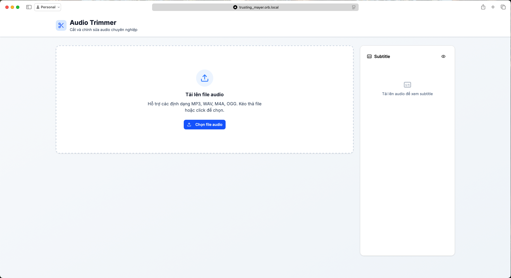
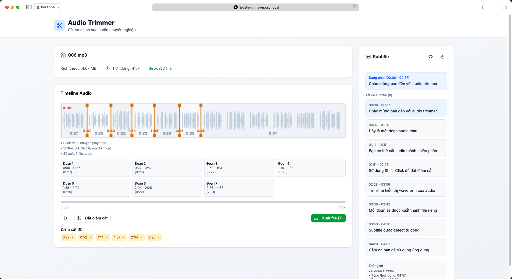

# Audio Trimmer

Cắt và chỉnh sửa audio chuyên nghiệp trên nền web. Hỗ trợ các định dạng MP3, WAV, M4A, OGG. Đặt điểm cắt, xuất nhiều file, xem subtitle tự động.

## Demo giao diện

### Trang chủ



### Giao diện cắt audio



## Hướng dẫn sử dụng

1. **Tải lên file audio** (kéo thả hoặc click chọn file).
2. **Nghe thử, di chuyển playhead, đặt điểm cắt** (Shift+Click hoặc nút "Đặt điểm cắt").
3. **Xuất file**: Mỗi đoạn sẽ được xuất thành file riêng.
4. **Xem subtitle**: Subtitle tự động hiển thị bên phải.

## Phát triển & chạy local

```bash
npm install
npm run dev
```
Truy cập [http://localhost:3000](http://localhost:3000)

## Đóng gói Docker

```bash
docker build -t nghex/audio-trimmer:latest .
docker run -p 3000:3000 nghex/audio-trimmer:latest
```

## Đóng góp
Mọi ý kiến đóng góp, pull request đều được hoan nghênh!
